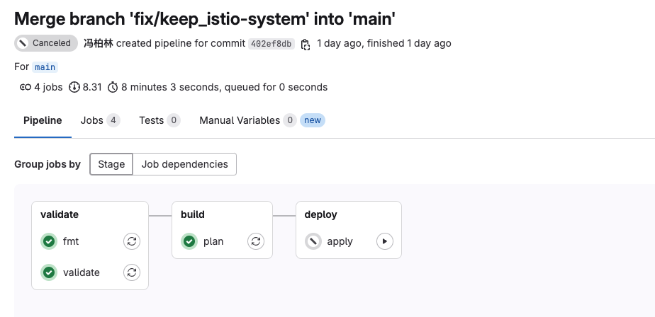
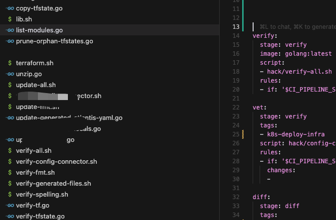
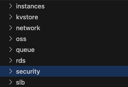

## 前言

在过去的几年里，[Terraform](https://developer.hashicorp.com/terraform) 和 Kubernetes 的陆续发布，全球大部分云服务提供商提供了无数的 Terraform [Providers](https://registry.terraform.io/browse/providers),使得声明式 API 进行 IaC 操作成了业界惯例。

Terraform 毫无疑问是一个很好的基础设施治理方案，采用声明式配置来描述基础设施，并进行标准化，比如使用版本控制管理配置、对变更进行评审，进行变更，回滚等操作，使得基础设施的管理过程和业界软件工程的最佳实践靠的越来越近。

之前在 TapTap 以及 心动都大规模使用 Terraform，我并不是这些仓库的维护者，但是因为 ops 团队经常无法满足实际的进度需求，有时候我自己也会去提 MR 来管理一些基础设施。同时在过去的一年多里，我一直都用 Terraform 来管理所需的基础设施。

在这里并不想写某个命令或者怎么安装某个资源,也不想分享它的好处，因为如果没有一定的收益，也就不会引入它了，因此更多的是分享自己的一些乱七八糟的想法，特别是从应用开发者的角度。

## 我们、他们是怎么用的

### 自动化

在 TapTap 使用 [Atlantis](https://www.runatlantis.io) 做 Pull Request Automation，基于 Atlantis 可以在 Pull Request 内按照机器人提示，在评论区输入对应指令，重新 plan。review plan 结果，确认出现的结果是你需要的。ops 同事 approve 之后，仓库会自动 apply。

在我自己的项目中都是用的非自托管的 Gitlab, 因此我们也就用了 [Gitlab IaC](https://docs.gitlab.com/ee/user/infrastructure/iac) 中的 [OpenTofu](https://gitlab.com/components/opentofu) 作 Pull Request Automation，它是兼容 Terraform 的。

提交 Pull Request 之后，会自动触发 fmt、validate、plan，可以非常方便的在 Pull Request 内看到 plan 的结果。

但它并不支持评论区指令识别的功能，自行 review plan 结果，确认出现的结果是你需要的，在 merge 之后，可以自动或者手动 apply。

### 最佳实践？

- 建议遵循 Google 提供的 [Best practices](https://cloud.google.com/docs/terraform/best-practices-for-terraform)
- Pull Request 记得标记 WIP 和 Draft，避免误操作合并
- 如果你是自托管的 Gitlab，并使用 [Atlantis](https://www.runatlantis.io) 那么你可以 hack 更多的逻辑做 tf 文件命名、资源命名、格式等等的规范，让自动化的过程更规范。

- 提供类似 `infra/template/default.tf` 这样的模版，
- 尽可能地模块化

  
  

## 吐槽

引入 IaC 对基础设施服务进行标准化，其中的一个好处是**减少开发人员和运维团队之间的摩擦**，这和 DevOps 的理念是类似的。但使用的过程其实也有不少槽点。

- 状态与协作
- 重构变得困难
- 访问控制

### 状态与协作

Terraform 是一个有状态的工具，它利用状态用来维护所定义的资源与在云供应商平台上创建的实际资源之间的映射关系。它必须在某个地方维护状态，并且需要在多人协作下保持状态的一致。因此在 apply 配置时，必须对状态文件进行锁定，带来的好处是我们可以确保在应用变更时，没有其他人在做同样的操作,但是可能导致数分钟的阻塞。在此期间，配置被独占，其他工程师无法进行任何变更。当有多个工程师管理基础设置的时候，可能会显得比较混乱，**增加了协作成本**。

比如我在增加 grafana 时，helm 源一直超时，等待了几分钟后无果手贱强行结束了 Gitlab 的 apply job 导致的 state 锁定。于是所有人包括你自己都无法进行其他的 apply 操作了，只能在如图这个页面上点击 Action 中的 unlock 来解锁。

如下图是我尝试在本地进行一次测试时，自动生成的一些 state 文件，但在只有可能几十个左右的资源类型的时候执行 plan 命令依然需要好几分钟才能有结果。

给我的感受是：**Terraform 在状态这一块有一个稀烂的实现。**

### 重构变得困难

#### 旧有未纳入资源的重构

很多团队可能并不一开始就使用 Terraform，而它无法很好地将已有资源纳入到它的状态管理中。好在，Terraform 引入了 import 命令缓解了这个问题。但又出现了另一个与此紧密相关的问题——如果你的栈很大，就必须为每个资源多次使用 terraform import 命令。如果这个过程无法自动化，这就变成了一个非常耗时且令人感到沮丧的过程。

想象一下，一个工程师在处理一个线上故障，TA 通过云服务商的控制台对生产环境的某个配置直接进行了修改。这个状态没有同步到 Terraform，之后会怎么样呢？

#### 已纳入资源的重构

既然是 IaC, 从软件工程的实践上**重构是必然的**。

比如可能从一个 sdk server 配置开始，然后逐渐分为 login、auth、 payment 等小配置。这也是 Terraform 推荐的：把配置分离为小粒度的配置。然而因为 state 的存在，甚至轻易改动已有资源名称都是"不可以"的，虽然有 state mv，这个过程就变得非常痛苦。因此随着时间的推移，配置就变得越来越难以维护。

### 访问控制

每个团队如何只具备自己需要的权限——有的可能只需要管理 A 资源、其他的可能有权使用 B 或者 C 资源，Terraform 在访问控制的抽象并没有太多的支持。于是，在 TapTap 的所使用的是不同团队采用不同模块,分别经过团队 ops、仓库统一负责人进行审核的方式。

还有一个问题是：该把秘钥保存在哪里?

Hashicorp 有他们的 Vault，但它使整个设置变得更加复杂。与 Vault 类似，使用使用私有 git 存储库，只要电脑不被偷，就不会有什么问题。如果你是在 CI/CD 上运行作业，可以将秘钥保存在环境变量中，但在一个复杂的系统中，可能就难以维护太多的环境变量。

在这个方面 Terraform 并没有提供一个更好的实践。

## 总结

基础设施即代码（IaC, Infrastructure as Code）是正确的方向！

但抽象总是尝试隐藏细节，而抽象同时也损失了细节。 Terraform 的引入对于应用开发者来说，配置的抽象程度提高了，也就引入了新的复杂度。

但为什么依然要选择 Terraform？在我看来，是并没有更好的选择。如果你的系统每天都有大量重复的基础设施小变更，那么 Terraform 会是一个不错的选择！
