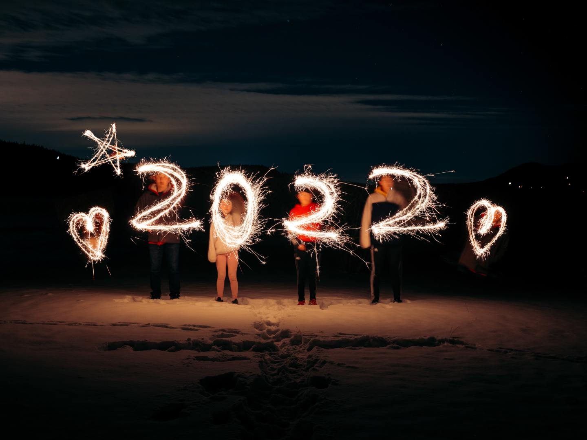
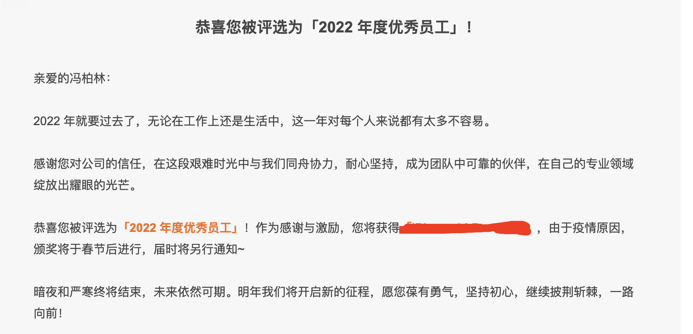
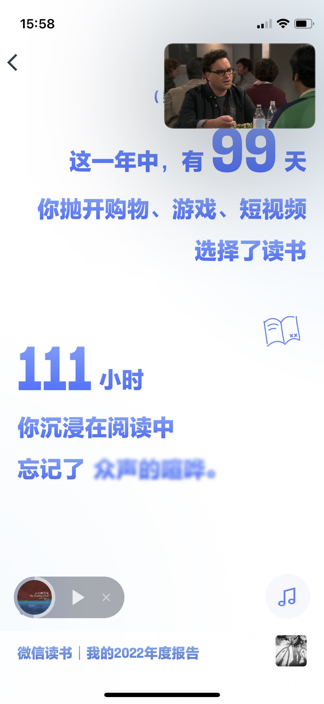
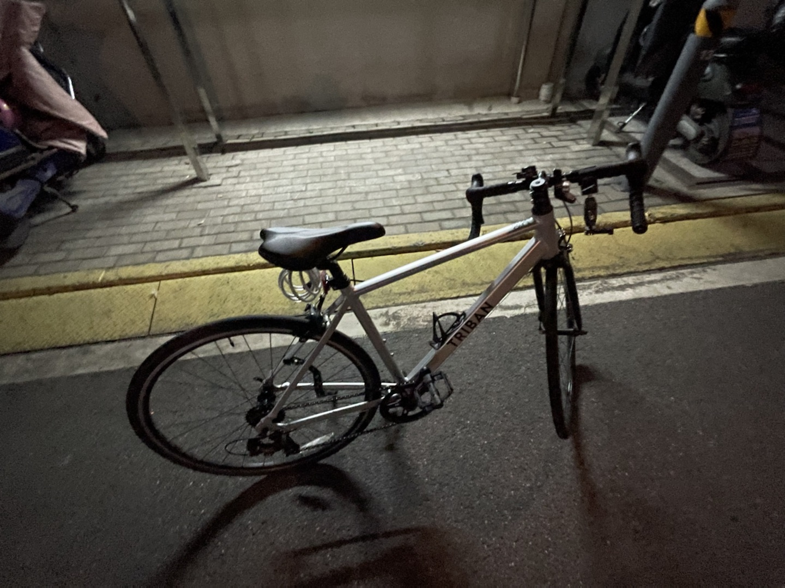
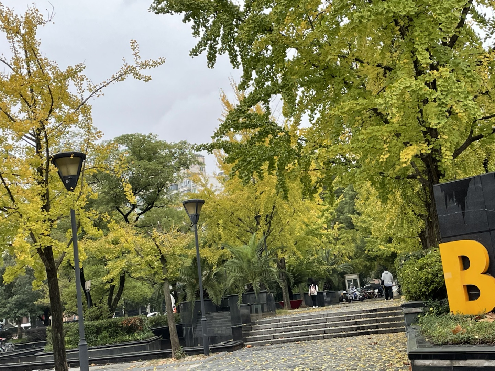
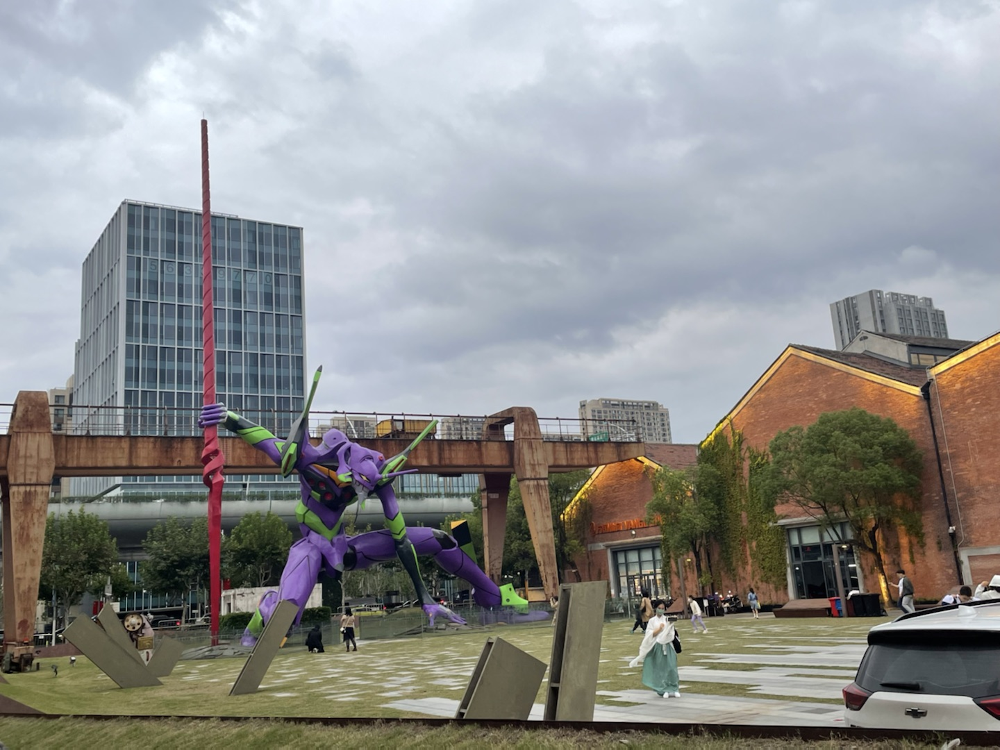
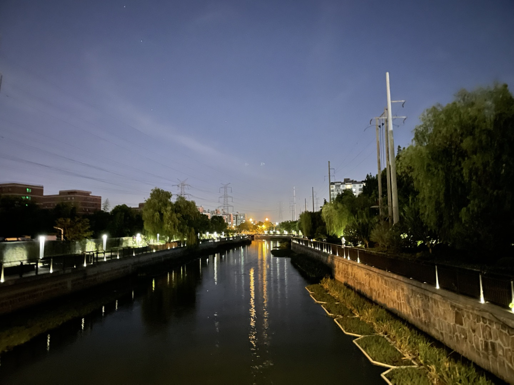
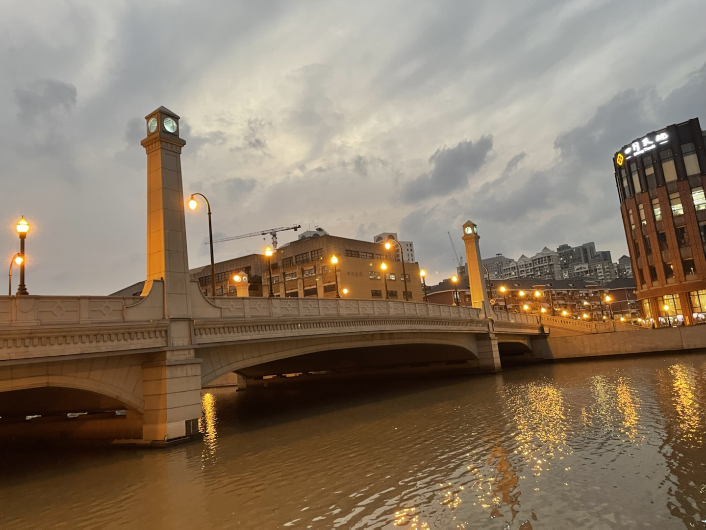
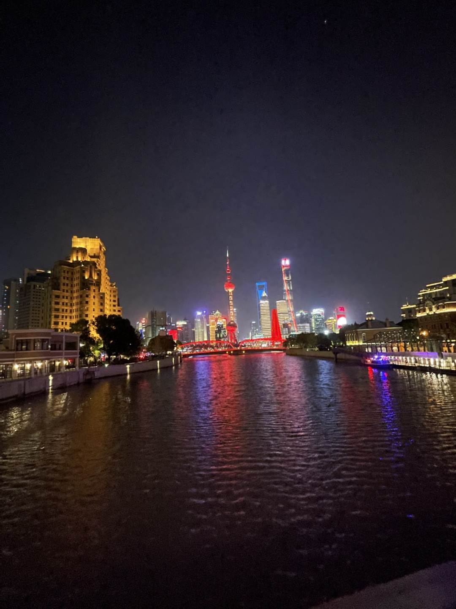

- [工作](#工作)
- [读书](#读书)
- [理财投资](#理财投资)
- [播客](#播客)
- [博客](#博客)
- [骑行](#骑行)
- [疫情](#疫情)
- [娱乐](#娱乐)
- [下一年](#下一年)

**2022 真是魔幻的一年！**

## 工作

年初的时候我还在考虑把 LeanCloud 的 [RTM 服务](https://leancloud.cn/docs/#%E5%8D%B3%E6%97%B6%E9%80%9A%E8%AE%AF)如何从 Clojure 技术栈迁移到 Java 技术栈。2 月团队交接过来一个烂摊子的业务，俊文希望我能够参与到这个业务的后端建设中。于是手上的一些就暂停了下来，直到现在我成了这个业务的负责人。对于这个业务产品或者技术上的各种观点，这里不再赘述。

从参与到 XDSDK 的业务以来，就工程师的角色而言，我觉得自己还算是尽心尽力，尽可能地在有限的资源下把事情做好。五六月份俊文觉得需要我承担更多的责任于是让我负责整个业务的协调工作。10 月份团队做调整，于是我成了 XDSDK 的负责人，部分客户端+服务端同事向我汇报。

从执行到 Team Leader 的变化并没有给我带来更多的时间可以思考团队的发展等等，反而让我在研发的角色之外需要花更多的时间参与团队管理和更多的沟通。这个过程中有不少客观因素但我自己做得并不好，希望 2023 年可以从容一些。

Q4 我觉得自己做得并不好，不过俊文和江宏还是提名了我优秀员工，最后喜提一份`小礼物`。

这一年的工作占据了我不少额外的生活时间，工作总是很忙碌，这和我一年多前加入江宏团队的目的也越来越来远。 2023 年这种忙碌如果客观事实上得不到改善，那我自己会主动通过其他的手段来改善。

这一年的种种经历让我对软件工程、历史遗留、团队管理、如何把一个产品做坏也有了更深的理解。此处种种余后再表.......

## 读书

2022 年加到微信读书书架里的书挺多的，也买了不少的纸质书。大部分和工作主要包括：团队、管理、绩效。读完的包括：

- 《Code Complete》重读
- 《增长黑客》
- 《10 人以下小团队管理手册》
- 《敏捷革命》
- 《我读管理经典》
- 《团队协作的五大障碍》
- 《新管理者如何度过第一个 90 天》
- 《不拘一格：网飞的自由与职责工作法》

其他有不少都在下半年上下班骑车的路上用 1.5 倍的倍数听了些需要快速补充的内容。

今年写了 3 篇读书笔记，还是希望 2023 年尽量能把读的每一本书简单做一下读书比较，像 2020 年那样每月发一些读书总结也是不错的形式。

## 理财投资

在我工作的前三年里，我一直是采用比较激进的投资理财策略的。包括股票、基金、P2P 等等，早期在 P2P 上的投入甚至让我有了不小的收益，甚至有过用阿里内部员工花呗额度加杠杆的想法。但 2021 年之后我的投资理财策略则变得相对谨慎了。

今年的理财投资依然集中在基金和黄金上，股市的动荡也让收益变得不可预测。特别是在中概股上的投资，变得跌宕起伏。不过一年下来依然有 8% 的收益率，也算得上跑赢通货膨胀了......

可以预见的是 2023 年我自己的投资策略依然会比较谨慎，保持长期持有和定投的方式。在理财上的资金占比不会超过我个人储蓄的 1/3，可预见的是 2023 年的经济环境依然不会好到哪里去。保持健康的现金流是首要的任务。

## 播客

下半年骑行上下班之后，一般都会听一听博客或者有声书，今年依旧在听的有
《忽左忽右》、《疯投圈》，《Page Seven 胡先笙》因为不再更新了就偶尔回去挑一些觉得有意思的听听。

此外为了在团队管理上有些补充，还花钱没了一些极客时间的课程，包括：《技术管理实战 36 讲》、《郭东白的架构课》、《朱 X 的技术管理课》，总的来说不是很值当。对实际的团队管理或者工作的帮助实在有限,以后应该会比较少买这方面的课程了。

## 博客

今年恢复了写博客， `linnaname.github.io` 总算是有了一些内容。

写了 3 篇读书笔记，2 篇关于团队管理的博客。关于团队管理今年遇到了不少的事情，其实有很多想说或者记录下来的。但由于时间以及很多想法都不太成熟，打算 2023 年逐渐写写。

## 骑行

9 月在搬到离公司的 3 公里左右的新地方之后买了自行车，这也是我第一次买公路自行车。嗯，多少有些不太好骑。

在天气变冷之前一直都是骑车上下班，周末偶尔出去骑一次稍长距离的。但总得来说今年没有什么很大的骑行量，一是上海骑行体验实在太差了，二是公路车的骑行体验也不太习惯。希望 2023 能坚持周末多出去一些远一些的地方，考虑换一辆山地车。

10 月的时候头脑一热买了第一台 Go Pro，用了几次拍了一些视频最终也都没有剪辑。不过总得来说消费级的运动相机的体验和我想象的还是有不少的差距，在续航、使用体验上感觉都还有很大的空间。短期内看这是一项不值当的投入，不过总算又多了一个出门的理由......

## 疫情

3 月份在上海亲历了封城，这次集中营式的封城或许让我对政府、政治、公民的权利与义务又有了一些重新认识。然后 12 月份却又忽然宣布完全放开了，12 月我们就又在没有太多准备的情况下得了新冠，现在依然觉得身体元气大伤。

似乎一夜之间那些所谓的专家又懂得了科学，而此前他们只懂得政治。似乎政府此前是集权政府却又想让人觉得它是拥护人权的。

## 娱乐

2022 年似乎并没有什么让人特别期待的好剧，而电影院疫情之后就基本没有去过。于是 《生活大爆炸》和 《老友记》经常被当成背景音放在。

2022 年终于有中国车手走上了 F1 的舞台，周冠宇的出现同样也让包括我在内的中国车迷在每场比赛多了一些期待。而且整体小周的表现是非常不错的，就是车队有些拉胯。此外法拉利依然是最能整活的，总是让比赛变得`有意思`...。但总的来说今年的 F1 竞争还是没什么意思，2023 年 F1 中国站又取消了，2023 年似乎会延续 2022 年平平无常的情绪。

2022 年 LCK 在 S12 赛场上干碎了 LPL，当 SKT 在决赛上以 2:1 领先的时候我觉得 Faker 离他的第四个全球总决赛冠军是如此的近。然而遗憾的是 DRX 在随后缔造了奇迹，最终以 2:3 赢下了比赛。

2022 年四年一届的世界杯如期举行，赛前包括我在内估计很少有人会预测阿根廷夺冠。没想到却有幸能够亲历这么多年以来最精彩的足球决赛，最后通过点球大战阿根廷人捧走了大力神杯。更让人感慨的是梅西终于捧起了大力神杯，梅罗之争走向了落幕，特别是在 12/31 这一天 C 罗宣布不在五大联赛踢球了。**这是一个时代的结束，可能有些残酷但从此以后 C 罗只能是梅西时代的伟大球员之一**。

## 下一年

- 减肥已经成了优先级非常高的事情，恢复到 130 斤左右
- 希望能把 2022 年买的几个大部头书读完，包括 《软件工程》、《编程与类型系统》等等。
- 勤作读书笔记
- 写至少 6 篇博客
- 技术专题：需要一个后端技术专题
- 骑行：希望今年的骑行距离能够超过 1000 公里