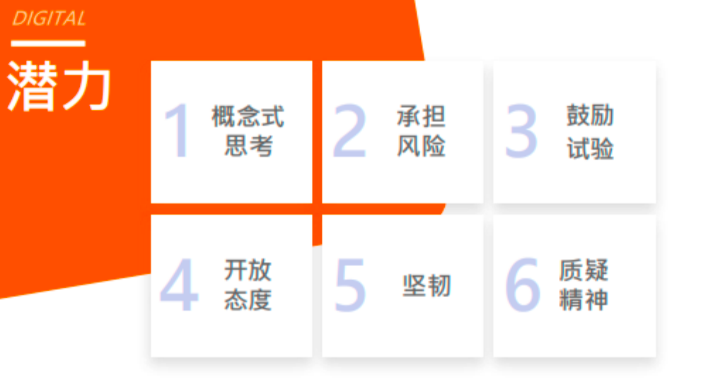
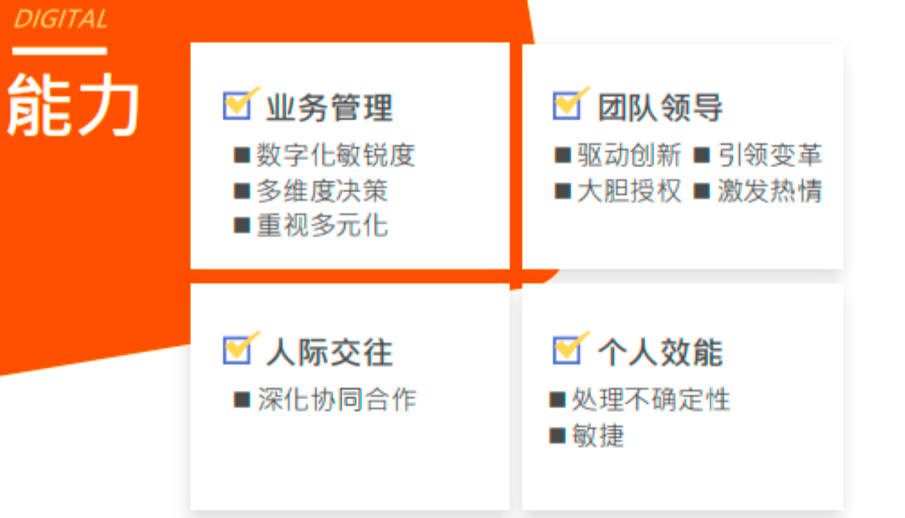
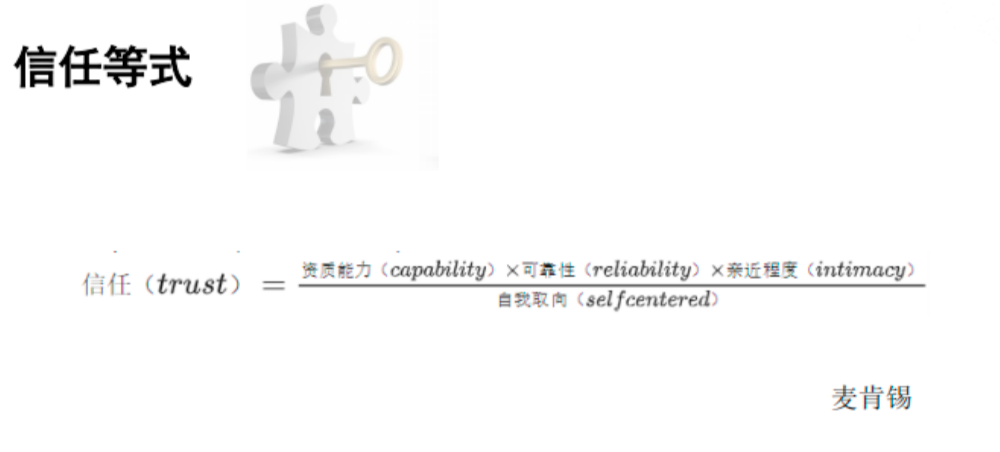
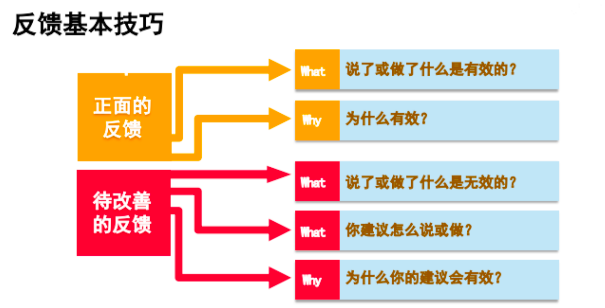
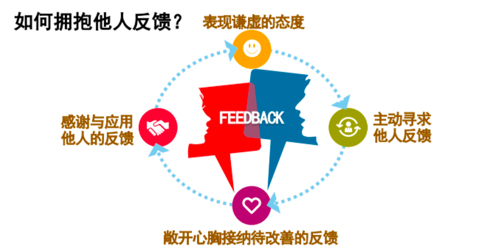

## 领导者的画像
作为管理者，我们在判断一个人是否匹配某个岗位，主要从知识、经验、能力、个人特质四个维度评估，其中特质是最难判断的。

DDI成功典范模型参考：
> 做过什么奠定经验基础，知道什么奠定技术专业基础，能做什么就是一系列行为表现，而你是什么样的人就是做事能不能成功的潜在因素。

现在是 VUCA 时代，易变（**Volatility**）、不确定性（**Uncertainty**）、复杂（**Complexity**）、模糊（**Ambiguity**）；

这个时代又很看重数字化，领导者有四大任务参考：
- 知道：探索高不确定性环境，敏捷学习，识别机会与风险，制定决策
- 做到：提出创造性解决方案，快速大胆行动，落实成果
- 人到：大胆授权，广泛结盟，以多样性为优势，构筑合力
- 心到：描绘愿景，传递信心与热情，促进创新，推动变革

对领导者的能力、潜力参考如下：

## Part 2：管理者的角色转变

1、从个人贡献者变成管理者，什么是领导者的思维模式？

- 阳台思维：从更高的视角关注团队成员的工作模式
- 树顶思维：了解部门和其他团队融合的状态
- 直升机思维：用直升机的视角，从团队、组织、行业不同维度，为团队找到转型的方向，顺利地适应各种冲击与变化

2、从个人贡献者变成管理者，从理念、时间、技能上都会有变化
- 工作理念（方向重点）以“防火”大于“救火”的导向；
- 工作时间，对应的重要工作内容发生变化，课堂上根据自己练习发现我们所花的时间还是常务工作很多，却不在重点工作要务范畴里，所以也需要学习相应的新技能来改善这样的状况；
- 技能方面，有能力、潜力（偏个人特质），不同时期要求不同，具体可参考上方领导者潜力能力参考。

> 其他管理视角参考-内容来自拉姆查兰《领导梯队》
在工作理念方面一线经理肩负的管理技能有以下主要事项：
1）通过他人完成任务；2）部门及下属的成功；3）管理性工作；4）正直诚实。
在时间管理方面一线经理肩负的管理技能有以下主要事项：
1）计划与安排，项目进度；2）与下属沟通的专门时间；3）为部门和团队设定时间的优先次序；4）与其他部门、客户和供应商沟通的时间。
在工作技能方面一线经理肩负的管理技能有以下主要事项：
1）制订计划；2）人员选拔；3）授权；4）绩效监督与评估；5）辅导与反馈；6）奖励与激励；7）沟通、营造工作氛围；8）为部门发展建立多方位的良好关系；9）获取资源。

## Part 3：领导者应有的自我修养
1、领导者应该具备三个素养参考：言行一致、启发他人展现最佳表现、拥抱反馈

言行一致：言所当言，行所当行

启导他人：能够识别不同个体的特点，用不同的方式启发

拥抱反馈：1）安静聆听不反驳；2）进一步澄清细节；3）表达感谢；4）切实采取行动。

