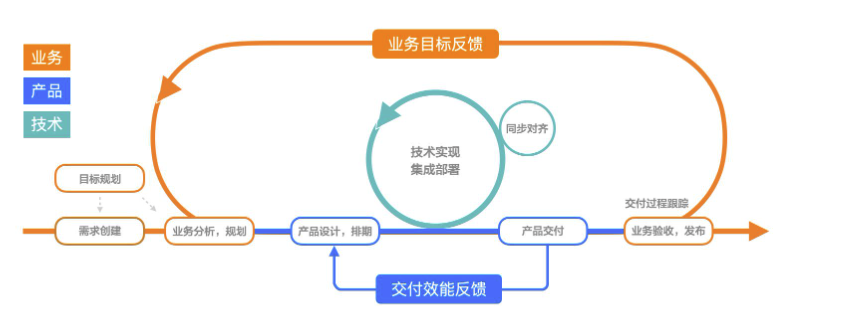
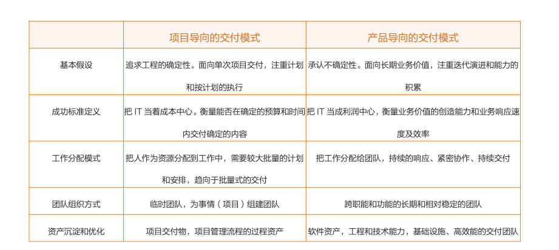

# 如何做项目管理

## 

在产品导向的交付模式下，组织应该把技术交付团队看成利润中心而非成本中心，面向产品和业务建设跨功能和相对稳定的产品交付团队，以业务价值和业务响应来衡量和激励产品交付团队。而团队则面向业务价值，持续地迭代和学习，并积累软件资产、工程和技术资产，提升自己的响应和交付能力

## 版本 owner

把工作分给相对稳定的多功能团队。

在人员管理上，项目管理会先规划预算、确定范围、做出计划，再按计划把人分配到项目中。项目结束时，人员被释放，准备进入下一个项目。这一模式下，人被当成可替换的资源。对于确定性高且响应速度要求低的业务，项目的人力配置方式有它的优势，尤其是加大了人员的使用效率。数字化时代业务的不确定性越来越高，对 IT 的响应速度要求却越来越高，对产品的持续健康演进要求也越来越高。项目管理中的团队组建模式带来以下问题：1）由于每次都要先确定内容，再做出计划、组建团队，必然会延长需求的响应和交付时间，满足不了即时响应业务的需要；2）由于项目团是临时组建的，只对短期的交付负责，很难保证长期的业务结果，同时业务方对产品的长期演进和持续的交付效能负责。

团队的组织方式。产品交付团队是相对稳定的，对长期的产品演进、交付效能、业务贡献负责。为此，这个团队应该是 1）跨功能的，包含产品、开发、测试等角色。只有这样才能直接面向业务，完成产品需求的加氟，才能集体改进交付效能；2）被充分授权的，比如：在满足外部业务需要的情况下，被授权演进自己的协作方式、技术和工程实践。只有这样才能够；3）相对长期稳定的。长期的团队才能对长期的结果负责

IT 的工作一切源自业务，业务驱动各个职能和功能的协作和快速交付；IT 的工作必须回到业务，形成有效的学习闭环，支持业务的创新

从忙碌->出错->更忙碌->更出错的死循环中跳了出来