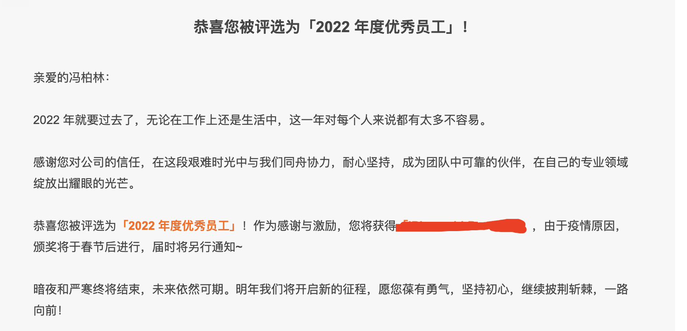

# 我是如何成为团队管理者的

加入[江宏](https://baike.baidu.com/item/%E6%B1%9F%E5%AE%8F/16508711)团队不久之后，我正在在参与到 [LeanCloud](https://www.leancloud.cn   ) 的即时通信、消息推送从 Clojure 向 Golang 和 Java 的重构中。同时我还是这个小组的负责人，这个小组负责的服务包括[即时通信](https://www.leancloud.cn/rtm/)、[消息推送](https://www.leancloud.cn/notification/)以及即时语音。

但是 2022 年初大团队接手了一个坑比较多业务和一部分移交过来的人员，Leader 和我沟通之后让我参与到这个刚交接过来的业务中。于是开启了一段新的挑战。

## 从实际情况出发，先了解再参与

任何方案的实施都要以对现状的理解为基础,比如说现有的组织结构、对新方法的接受度、具体的业务特征、技术成熟度等。脱离具体的上下文，照搬“普适”的框架，会带来巨大的适配成本。前期花费大量精力在组织和流程上，却不直接改善交付效能，特别是业务可见的效能。这非常容易带来怀疑和抵制，让实施效果大打折扣，甚至半途而废

从现状出发，寻求持续且渐进的改进。在系统改进目标的牵引下，以小步前进，每个小步都带来改进，最终实现系统和全面的转型。渐进不是妥协。恰恰相反，它是在明确且坚定的最终目标下选择更坚实和可持续的路径。改变必须从理解和尊重现状开始。

## 赢得信任
保证技术实施的一个关键是，大家都信任你。一旦大家都不信任你的时候，又或者是你不信任自己的时候，那么这个项目就会出现问题。它需要我们一步步地去构建出信任感。

除此，当你空降到一个新的团队时，便面临着不少的挑战。陌生的代码库，试探你能力的成员……。

## 捉住重点

≈

## 主动做沟通

## 持续改进工程实践

[我们如何做代码评审](/blog/tech/codereview.md)

## 改进版本管理和需求管理

版本管理，可以看到我们的[版本更新日志](http://docs.xdglobalapi.com/changelog)

需求管理

## 做好上下游合作伙伴的沟通

## 争取尽可能多的支持

- **文档**：和技术支持团队沟通把对外支持和答疑交给技术支持。文档的主要内容依然由研发来负责，但是文档的改善交给技术支持。并和技术支持团队的主管保持每个季度至少一次沟通，和对接的技术支持同事保持每个月至少一次沟通。
- **SRE**：和 SRE 团队沟通把更多的业务运维的事情交给 ops 同事

## 适当的时候强势一些可能是必要的

## 意外总会发生的，重要的是如何面对

## 适当放权

客户端放权：虽然我有过写一些 Android Demo 以及 iOS Demo 的经历，但是在客户端方面我并不是一个合格的工程师，而且短时间内也很难在这方面有快速的补齐。因此在团队稳定之后决定把客户端的协调的工作交给了一位比较有潜力的客户端同事，TA 负责客户端接口以及架构相关的决策以及对外的客户端问题沟通。在客户端方面除了版本计划、架构设计、代码评审等为了保持对业务的熟悉我会**略有**参与外即使是这些事情更多的也是客户端小组的负责人来跟进，绝大多数的事情我并不会直接干预。

服务端的稳定性是团队的核心任务，因此我对服务端的关注以及实际 coding 也更多。我依然保持

项管权限让渡：在各系统的稳定性得到明显提升之后，我觉得把版本管理的职责也交还给项目经理，让项目经理在项目管理以及对外的需求沟通上发挥更大的作用。

## 和团队一起制定 RoadMap，持续投资重要且有价值的事情

季度 RoadMap

年度 RoadMap

我们会把季度 roadmap 和年度 roadmap 放在 Figma 上供大家查看和评论。

持续投资重要但不紧急的事情

## 让不合适的人尽早离开

在团队相对稳定之后我决定让其中一位同事离开，可能这出乎一部分人的意料。觉得当团队主管不久应该求稳以及当老好人是更好的选择。

**主动裁人可能是一个非常痛苦的过程，但是对于 Tech Lead 来说可能又是必须经历的事情**。不合适的人在团队里可能确实起到一个人力的作用能干一些活，但是却可能拖累团队，同时也容易让优秀的人离开。因此当发现一个人真的不合适团队的时候，应该尽早考虑和安排让 TA 离开的计划。

当然发现一个人是否合适团队是一个持续观察的过程，同时也应该关注和 TA 协作的同事对 TA 的评价，征求直属 Leader 的看看等等，而不是单纯的从 Tech Lead 自己个人的情绪或者短期的主观判断。

如果最终决定要做汰换,可以：
- 考虑清楚汰换的计划，汰换的前提是尽量不影响业务的推进以及团队的士气
- 和上级主管、部门 HR 沟通好汰换的计划
- 推进招聘，补充新鲜血液
- 让新人逐渐融入
- 和被动离开的同事做沟通，这个过程可以让 HR 来主动，但是提前双方能够”和平分手“
- 主动和团队的核心成员沟通，告知被动离开同事离开的时间和原因，这更多是为了稳定团队士气

不合适团队的人并不是表示 TA 不够优秀，也并不意味着和被动离开的同事成了敌我双方，更多的是双方不匹配，所以在沟通上我们还是应该尽可能地争取”和平分手“，该为离开同事争取的利益就应该主动和公司以及 HR 争取。

关于如何招聘以及如何做技术面试可以看我另写的其他两篇博客，《[如何招聘](/teamlead/how_to_hire.md)》和《[如何进行技术面试](/teamlead/interview.md)》

## 把事情做好，好的结果是顺其自然的事情

在参与到这个团队业务的 3 个月后我成为服务端的负责人，那之后虽然在 title 上还没有给予我负责人的头衔，但是事实上我已经成了团队的负责人。6 个月之后在一次组织架构调整中，我顺理成章地成为了团队负责人，团队成员包括：客户端研发 4 人、服务端研发 3 人、QA 1人（另外包括 2 名外包）、产品经理 1 人、前端研发 1 人。

到了年底被直属主管和部门负责人提名年度优秀员工

然后被评选为 100 多人的大团队里唯一一个**年度优秀员工**

**一个员工在原有职级上想要往上晋升，可能需要两到三个季度持续表现出上一个职级的能力才可能获得机会。很多时候我们会过分地纠结于是先付出还是先得到，这样的犹豫是很容易让机会溜走的**。

## 经验教训

- 
- 在团队